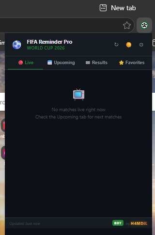
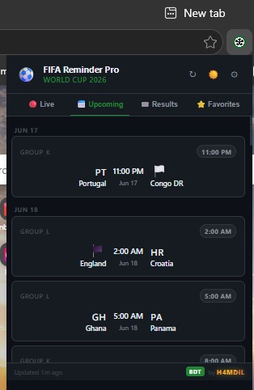
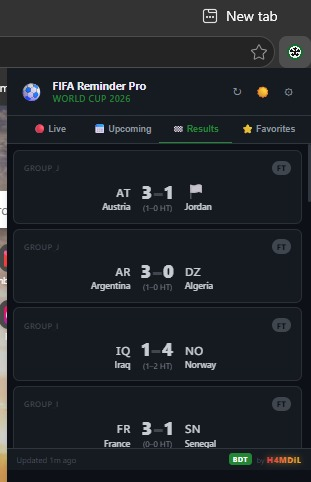
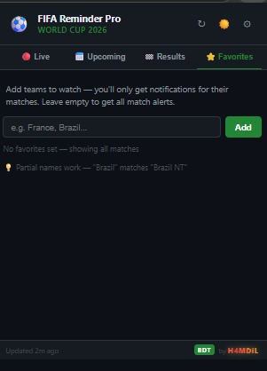
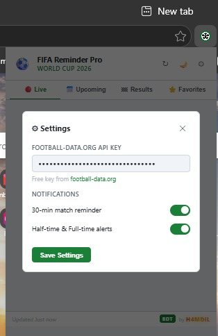

# ⚽ FIFA Reminder Pro

<div align="center">

### FIFA World Cup 2026 Browser Extension

Live Scores • Upcoming Matches • Results • Favorites • Notifications


</div>

---

## 📖 Overview

FIFA Reminder Pro is a lightweight browser extension designed for football fans who want instant access to FIFA World Cup 2026 information.

Track live matches, browse upcoming fixtures, view completed match results, save favorite teams, and receive match notifications directly from your browser.

---

## ✨ Features

### 🔴 Live Matches

- Real-time match monitoring
- Live score display
- Match status updates
- No need to refresh constantly

### 📅 Upcoming Fixtures

- Complete match schedule
- Kick-off times
- Team information
- Group stage identification

### 🏆 Results

- Full-time scores
- Historical match results
- Easy browsing

### ⭐ Favorites

- Add favorite teams
- Track only selected teams
- Personalized notifications

### 🔔 Notifications

- 30-minute match reminders
- Half-time alerts
- Full-time alerts
- Browser notifications

### 🌙 Dark Theme

- Modern football-inspired UI
- Eye-friendly dark design
- Fast and responsive

---

## 📸 Screenshots

### Live Matches



### Upcoming Matches



### Results



### Favorites



### Settings



---

## 🚀 Installation

### Chrome

1. Download repository

```bash
git clone https://github.com/ENiGMA-101/fifa-reminder-pro.git
```

2. Open Chrome

3. Visit:

```text
chrome://extensions
```

4. Enable:

```text
Developer Mode
```

5. Click:

```text
Load Unpacked
```

6. Select project folder

7. Extension installed successfully

---

### Microsoft Edge

Open:

```text
edge://extensions
```

Enable:

```text
Developer Mode
```

Click:

```text
Load Unpacked
```

Select project folder.

---

## 🔑 API Setup

This extension uses football match data from Football-Data.org.

### Get Free API Key

Visit:

🌐 https://www.football-data.org

Create a free account and generate your API key.

### Add API Key

Open extension.

Go to:

```text
Settings ⚙️
```

Paste your API key.

Click:

```text
Save Settings
```

---

## 🔔 Notification Types

### Match Reminder

```text
30 minutes before kick-off
```

### Half-Time Alert

```text
Sent when first half ends
```

### Full-Time Alert

```text
Sent when match ends
```

---

## 📂 Project Structure

```text
├── manifest.json
├── popup.html
├── popup.js
├── background.js
├── styles.css
├── icons/
├── assets/
└── README.md
```

---

## 🛠 Built With

- HTML5
- CSS3
- JavaScript
- Chrome Extension API
- Football-Data API

---

## 🎯 Roadmap

### v1.1.0

- Team logos
- Match statistics
- Goal scorers
- Search functionality

### v1.2.0

- Multiple tournaments
- Custom notification timing

### v2.0.0

- User accounts
- Cloud sync
- Mobile companion app

---

## 🔒 Privacy

This extension:

✅ Does not collect personal data

✅ Does not track users

✅ Stores settings locally

✅ Uses only the provided API key

---

## 📜 License

MIT License

---

## 👨‍💻 Author

### H4MDiL

GitHub:

https://github.com/ENiGMA-101

---

⭐ Star this repository if you enjoy the project.
